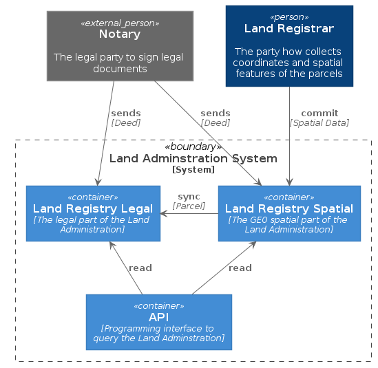
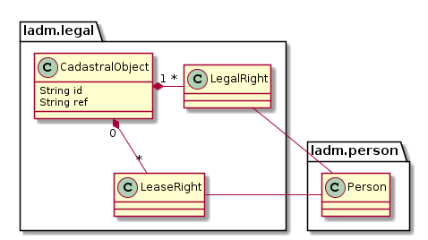

# Land Administration System

This is an example of the Model Driven & Low Code Playground for the Land Administration System.

This is the root folder with all sources in `./src` and all generated files in `../target`.

The **System Context** is defined in [`src/system-context.puml`](src/system-context.puml), a [PlantUML](http://en.plantuml.com/) file using the C4 extension of [Ricardo Niepel](https://github.com/RicardoNiepel/C4-PlantUML). The result (at some point in time) is this:

This displays that the Land Administration system consists of _two_ systems, one for the legal parts and one for the GEO spatial parts. This is the case in most countries, at least it is for the Netherlands ;-)

Taking a look inside the Land Registry Legal 'container' this structure is defined in [`land-registry-legal.puml`](land-registry-legal.puml). The result (at some point in time) is this:

